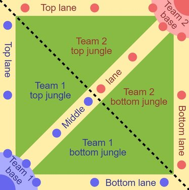

```{r, echo = FALSE, include = FALSE}
# Esto es un bloque mágico que hará algunos output (en html) más manejables.
options(width = 60)
local({
  hook_output <- knitr::knit_hooks$get('output')
  knitr::knit_hooks$set(output = function(x, options) {
    if (!is.null(options$max.height)) options$attr.output <- c(options$attr.output,
                                                               sprintf('style="max-height: %s;"',
                                                               options$max.height))
    hook_output(x, options)
  })
})
```

# Introducción

*League of Legends* es un juego multijugador de arena de batalla en línea (*MOBA*), desarrollado y publicado por *Riot Games* en 2009. En cada partida, dos equipos de cinco integrantes cada uno, lucharán por derribar el "Nexo" enemigo, el cual es una estructura colocada en el lado opuesto de donde comienza cada equipo. En el modo clásico, cada uno de los integrantes controlará un personaje distinto denominado "campeón", con un set de habilidades único y diferentes estilos de juego.

El anterior mencionado "Nexo" está protegido por distintas estructuras y "súbditos", unos enemigos que aparecen periódicamente desde cada lado del mapa para ayudar a los "campeones" en su propósito de abrirse paso hacia la base enemiga. Esos súbditos dan "oro" y "experiencia", lo cual es necesario para mejorar a tu "campeón" a base de objetos (que se compran con "oro") y "niveles" (los cuales mejoran tus "habilidades").

La arena se conoce como "La Grieta del Invocador" y toma esta estructura (simplificada):

-   Hay 3 "líneas" o calles: por ellas caminarán los "súbditos" y están protegidas por 3 "torres" por cada equipo en cada calle antes de llegar a la "base" rival. Las "líneas" son *Top, Mid* y *Bot.*

-   El resto del mapa que no es ni una "base" ni una "calle" (en verde oscuro en la imagen) se conoce como "jungla", en la cual hay monstruos neutrales (los cuales se comportan como los "súbditos" mencionados anteriormente) y objetivos importantes para acabar la partida como los "Dragones", "Heraldos" y "Barón Nashor". Estos objetivos proporcionan mejoras al equipo que los reclame.



[Original PNG version by Raizin, SVG rework by Sameboat](https://commons.wikimedia.org/w/index.php?curid=29443207)

Los "campeones" por defecto no pueden ver todas las zonas del mapa (y algunos "campeones" basan su identidad en no ser vistos, p. ej. *Shaco* o *Evelynn*), por lo que es necesario comprar "guardianes de visión" para colocar en las zonas de "jungla" y posteriormente en las zonas del mapa derribadas durante el transcurso de la partida.

La mayoría de los eventos generan "oro", p. ej., la primera baja que suceda en la partida (*first Blood*) da 400 de "oro" al "campeón" que la reclame, una baja habitual da 300, romper una torre da 50 de oro a cada miembro del equipo y 100 al que la tire, un tótem da 20, etcétera.

En *League of Legends* es posible rendirse si al menos 4/5 de los integrantes del equipo están dispuestos a ello en el minuto 20 de partida, existiendo una ocasión extraordinaria a los 15 minutos si dicha rendición es **unánime.**

Este título se ha coronado como uno de los videjuegos con más jugadores concurrentes, con una cifra de [152 millones](https://activeplayer.io/league-of-legends/) de jugadores a día de hoy. Estas cifras han hecho que este juego tenga mucha actividad a su alrededor, y mucha actividad económica se haya desarrollado en su ecosistema, como merchandising no-oficial, o aplicaciones de terceros.    

[*Mobalytics*](https://mobalytics.gg/) es una empresa que desarrolla *software* a modo de *overlay* (*software* que se ejecuta mientras juegas para añadirte información) sobre distintos títulos de *Riot Games*, incluido el *League of Legends*. Esta empresa recopila datos sobre sus usuarios y el desempeño en sus partidas de cara a proporcionar mejores guías e indicadores para que sus usuarios puedan mejorar en el videojuego.

Este *overlay* necesita conocer qué datos son más determinantes de cara a predecir si la partida se puede ganar o no, de cara a mostrar a sus usuarios si votar rendirse porque la partida está **inevitablemente perdida**, o si por el contrario todavía hay un tanto por ciento suficiente de posibilidades de  victoria como para que merezca la pena seguir jugando.


# Descripción del problema

Con esta introducción simplificada del funcionamiento del videojuego, se ilustra que existen muchas variables que dan ventaja a un equipo u otro. Aunque el objetivo final sea inequívoco para ganar la partida (derribar el nexo enemigo), hay muchas otras variables no tan directas como "Nexo destruido: Sí o No" que hay que tener en cuenta para dictaminar *a priori* qué va a pasar en los minutos siguientes, y poder predecir qué resultado va a tener la partida antes de derribar el nexo.

La amplia popularidad de este videjouego hace que sea muy factible extraer datos de este, ya que dispone de API pública, por lo que tendremos a disposición las variables cualesquiera que necesitemos. El objetivo en este informe es escoger un modelo de *machine learning* que prediga qué equipo va a ganar una partida en función de qué haya sucedido en la misma, asimismo como decidir cuáles son las variables más determinantes en dicho modelo.


# Análisis en R

## Datos de origen

En principio se pretendía obtener datos reales al acceder a la [API Oficial](https://developer.riotgames.com/) de Riot Games, pero se demora entre 2 y 4 semanas de espera y tienes acceso limitado de entradas por consulta, por lo que se acabó descartando por falta de tiempo. Es planteable en un futuro reescribir este trabajo con datos de mi propia cosecha.

El *dataset* ha sido obtenido de forma pública y se puede consultar en [Kaggle](https://www.kaggle.com/datasets/bobbyscience/league-of-legends-diamond-ranked-games-10-min). El *dataset* contiene datos sobre partidas de [*elo*](https://en.wikipedia.org/wiki/Elo_rating_system) alto (de diamante alto a master, se adjunta una imagen para ilustrar que son el [top 2% de jugadores](https://www.leagueofgraphs.com/rankings/rank-distribution)), en sus primeros 10 min de duración.

## Librerías y semilla

A continuación se descargan e instalan las librerías de R y se establece una semilla para garantizar que se puede repetir el ejercicio.
```{r, results = FALSE, warning = FALSE, message = FALSE}
library(caret)
library(caretEnsemble)
library(corrr)
library(corrplot)
library(dplyr)
library(e1071)
library(factoextra)
library(GGally)
library(ggcorrplot)
library(ggplot2)
library(ISLR)
library(Metrics)
library(pls)
library(pscl)
library(pROC)
library(psych)
library(psychTools)
library(rattle)
library(readr)
library(reshape2)
library(rpart)
library(rpart.plot)
library(tidyverse)

set.seed(123)
```

## Carga de datos:

Los datos de origen vienen en un CSV, y RStudio permite hacer una carga sin mayores transformaciones gracias a la librería [*readr*](https://cran.r-project.org/web/packages/readr/readme/README.html).
```{r}
df <- read_csv("data/high_diamond_ranked_10min.csv")
```


# Exploración y limpieza de los datos

## Primer contacto

Se muestran las primeras líneas del *dataset*.
```{r}
head(df)
```

Se observa que hay 40 variables en el *dataset*, y a simple vista todas son numéricas. No obstante, se usa *str()* para obtener una descripción precisa sobre los tipos de variables.
```{r, max.height='200px'}
str(df)
```

Se aprecia que son todas de tipo 'num'. Para algunas funcionalidades de R será necesario tranformarlo a tipo factor pero se abordará sólo donde sea necesario. Se prosigue comprobando si hay elementos vacíos en el *dataset*.
```{r, max.height='200px'}
colSums(is.na(df))
```

No hay datos faltantes, por lo que el dataset es íntegro para seguir trabajando y no es necesario hacer tratamiento de faltantes.

Miramos propiedades generales de las variables con *describe()* del paquete [*psych*](https://www.rdocumentation.org/packages/psych/versions/2.3.3/topics/describe).
```{r, max.height='200px'}
describe(df)
```

## Variables correlacionadas por la naturaleza del problema

En base a mi conocimiento del funcionamiento del juego, hay variables que a simple vistazo van a tener gran correlación, por cómo se estructura el *dataset* y las reglas intrínsecas del propio *League of Legends*.

La columna *gameId* no aporta información puesto que no guarda nada mas allá que para cuantificar las partidas en los servidores de *Riot Games*, se puede quitar sin mayor impacto.
```{r}
df <- df[,-1]
```

Por cómo funciona el juego, en este *dataset* hay muchas columnas con información redundante, puesto que si un equipo se hace una baja (*blueKill*), se corresponde con que el equipo rojo obtiene una muerte (*redDeaths*), por lo que esas columnas siempre van a contener información complementaria (*Discalimer:* soy plenamente consciente que es posible ejecutarse en el juego, pero son un caso ínfimo y que no varía el oro de la partida, por lo que al quitar las columnas de las muertes no alteramos ninguna de las otras).
```{r}
df <- df[,!names(df) %in% c("blueDeaths", "redDeaths")]
```

De forma análoga, por las características del *dataset*, los datos están limitados a los primeros 10 minutos de la partida, por lo que también se pueden eliminar las columnas *PerMin* puesto que van a estar directamente correladas con columnas de su misma métrica. Las columnas que muestran un diferencial de oro o experiencia también se pueden suprimir en favor de los valores totales (*blueTotalGold*, y *redTotalGold*).
```{r}
df <- df[,!names(df) %in% c("blueCSPerMin",      "redCSPerMin",
                            "blueGoldPerMin",    "redGoldPerMin",
                            "blueGoldDiff",      "redGoldDiff",
                            "blueExperienceDiff","redExperienceDiff"
                            )]
```

Por último, este dataset agrupaba los [Monstruos Épicos](https://leagueoflegends.fandom.com/wiki/Category:Epic_monsters) en una misma columna, se ha decidido conservar con los datos por separado (*blueDragons, blueHeralds, redDragons, redHeralds*) para valorar si priorizar un objetivo u otro es determinante a la hora de ganar o perder.
```{r}
df <- df[,!names(df) %in% c("blueEliteMonsters", "redEliteMonsters")]
```

Se buscan correlaciones entre las variables que quedan:
```{r}
corr_first <- round(cor(df), 1)
ggcorrplot( corr_first,
            hc.order = TRUE,
            type = "lower",
            outline.col = "gray",
            tl.cex = 5,
            colors = c("#6D9EC1", "white", "#E46726")
          ) + ggtitle("Correlation Matrix")
```

Se puede observar que *blueAVGlevel* tiene una correlación muy alta con *blueTotalExperience*, y sus contrapartidas del equipo rojo *redAVGLevel* y *redTotalExperience*, una vez más una está en función de la otra (*TotalExperience* = 5 \* *AVGLevel* \* experiencia necesaria para subir de nivel). Entonces, se elige una de las 2 para representar este dato, en este caso los valores totales, quitando los promedios.
```{r}
df <- df[,!names(df) %in% c("blueAVGLevel", "redAVGLevel")]
```

La columna *redFirstBlood* es la contraparte de *blueFirstBlood* (puesto que si no consigue un equipo la primera sangre la consigue el otro), se suprime la variable del equipo rojo para seguir la misma estructura en todo el *dataset* al tener sólo *blueWins*, que es la variable a predecir (no existe *redWins* en el *dataset* porque precisamente sería la contraparte).
```{r}
df <- df[,!names(df) %in% c("redFirstBlood")]
```

## Variables correlacionadas restantes {#variables-correlacionadas-restantes}

Cabe destacar una correlación natural entre *blueKills* y *blueTotalGold* (y sus contrapartidas *redKills* y *redTotalGold*), puesto que cada *kill* da 300 de oro, pero al haber más formas de conseguir oro en el juego, no es pertinente eliminar ninguna de las dos.

Se analiza la distribución, separando entre equipo rojo y equipo azul por claridad a la hora de mostrar los gráficos.
```{r, message = FALSE}
df_sideBlue <- melt(df[1:14])
df_sideRed <- melt(df[15:26])

ggplot(data = df_sideBlue, aes(x = value))+
       stat_density()+
       facet_wrap(~variable, scales = "free")

ggplot(data=df_sideRed, aes(x = value))+
       stat_density()+
       facet_wrap(~variable, scales = "free")
```

Se puede ver que las variables tienen una distribución normal cuando se trata de variables no dicotómicas, mientras las dicotómicas (*blueWins*, *blueFirstBlood*, *blueHerlads*, *blueDragons* y sus contrapartes en *red*) cumplen con su definición. Las variables *blueTowersDestroyed*, *blueWardsPlaced* y *blueWardsDestroyed* (y sus contrapartidas en *red*) siguen una distribución logarítmica normal, puesto que los sucesos alejados del eje *Y* son muy improbables.

Los "Dragones" y "Heraldos" son dicotómicas por las características del *dataset*, puesto que no pueden suceder más de 1 vez antes de la marca temporal de los 10min.

Se hacen *boxplots* de los casos anómalos para encontrar *outliers* y decidir si se deben quitar.
```{r}
boxplot(df[c("blueWardsPlaced","redWardsPlaced")])

boxplot(df[c("blueWardsDestroyed","redWardsDestroyed")])

boxplot(df[c("blueTowersDestroyed","redTowersDestroyed")])
```

Se comprueba que son datos plausibles dentro de cómo funciona *League of Legends*, se podría valorar quitarlos si posteriormente perjudicasen al modelo. El caso más preocupante serían las partidas donde se tiran más de 2 torres al minuto 10, pero de momento no se van a sacar del *dataset*.

## Análisis de Componentes Principales {#análisis-de-componentes-principales}

Como continuación del proceso de limpieza y exploración de los datos, se realiza un Análisis de Componentes Principales (PCA). En caso de que fuese necesario, se usará un *dataset* con el PCA en un modelo para compararlo con el modelo escogido.

Para hacer el análisis, se elimina la variable a predecir (*blueWins*).
```{r}
df_noWins <- df[,-1]
df_Wins <-df$blueWins
```

A continuación se buscan nuevamente correlaciones después de la limpieza de datos
```{r}
corr_post <- cor(df_noWins)
ggcorrplot( corr_post,
            hc.order = TRUE,
            type = "lower",
            outline.col = "white",
            tl.cex = 5,
            colors = c("#dd1c77", "white", "#2c7fb8")
          )   + ggtitle("Correlation Matrix After Data Cleaning")
```

Se observa una tabla con el comportamiento que se esperaba, con los problemas de colinealidad descritos en [el apartado anterior](#variables-correlacionadas-restantes). A continuación, se hace un análisis de componentes principales del *dataset*, normalizándolo.
```{r}
df_PCA <- prcomp(df_noWins, scale = TRUE)
summary(df_PCA)
```
Se puede contemplar en la columna *'Cummulative Proportion'* que se necesitan muchos componentes para explicar la varianza de los datos, y que a partir del decimotercer componente el porcentaje acumulado es ínfimo. Con la gráfica a continuación, gracias a la función [*fviz_eig()*](https://www.rdocumentation.org/packages/factoextra/versions/1.0.7/topics/eigenvalue) del paquete *factoextra*, se ilustra lo que se acaba de mencionar con las proporciones de varianza acumuladas.
```{r}
fviz_eig(df_PCA, addlabels = TRUE, ncp = 16)
```

Con los 2 primeros componentes se podría explicar casi todo el *dataset*, pero se eligen los primeros 8 para tener un alto porcentaje (84.8%) de explicación de la variabilidad.

Con el gráfico a continuación se ilustra lo que aportan cada variable a las 13 dimensiones que se han elegido.
```{r}
fviz_cos2(df_PCA, choice = "var", axes = 1:13)
```
Se ilustra un biplot (con la función [*fviz_pca_biplot()*](https://www.rdocumentation.org/packages/factoextra/versions/1.0.7/topics/fviz_pca) en específico, la cual mejora en legibilidad) para ver con más claridad la relación entre cos2 con las 2 primeras dimensiones del PCA. 
```{r}
fviz_pca_biplot(df_PCA,
                label = "var",
                repel = TRUE,
                col.ind = "grey",
                col.var = "contrib",
                habillage = "none",
                gradient.cols = c("yellow","orange","red","purple"),
                title = "PCA - Biplot con gradiente en función de cos2"
               )
```
En este gráfico se pueden ver correlaciones ya descritas en la matriz, y con el gradiente las más oscuras son las que más contribuyen a las primeras 2 dimensiones.


Se prosigue con una muestra de los *eigenvalues* de cada variable contra cada componente principal. Se ha [invesigado](https://stats.stackexchange.com/a/88882) al respecto y R calcula los vectores y valores con el signo "opuesto" al intuitivo, mas cambiar un vector de signo sólo cambia su orientación y no su magnitud. 
```{r, max.height='200px'}
head(df_PCA$x)
```

Se puede comprobar como en el primer componente todos los valores del equipo rojo (el contrario a la variable a predecir, *blueWins*) tienen un valor negativo, puesto que cuantos más recursos obtenga el equipo contrario, más dificil será ganar una partida.


## Separación de los datos

Se escoge repartir los datos de forma aleatoria en 2 subsets, uno de entrenamiento y otro para comprobar posteriormente los modelos frente a los datos originales. Dividimos también el *dataset* sin victorias. El *split* se hace un 80-20 para cada uno de los *datasets*. Tranformamos en factores la variable a predecir para garantizar el buen comportamiento de los paquetes de R.
```{r}
mark <- sample(c ( TRUE , FALSE ), nrow (df), replace = TRUE , prob = c (0.8, 0.2))
train <- df[mark, ]
test <- df[!mark, ]

train_noWins <- df_noWins[mark, ]
test_noWins <- df_noWins[!mark, ]

train_asFactor <- train
train_asFactor$blueWins <- as.factor(train_asFactor$blueWins)

test_asFactor <- test
test_asFactor$blueWins <- as.factor(test_asFactor$blueWins)
```


# Modelos escogidos

En este trabajo se tratan 3 modelos distintos de *Machine Learning*:

1.  [Regresión Logística](#regresión-logística)

2.  [Naive Bayes](#naive-bayes)

3.  [Árbol de Decisión](#árbol-de-decisión)

Posteriormente en el apartado de [Métricas](#métricas) se decidirá cuál es el más apto para la resolución del problema.

## Regresión Logística 

### Modelo GLM

Se usa la función *glm()* (modelo lineal general) y especificamos *family = "binomial"* para usar un modelo de regresión logística al *dataset*. La variable a predecir es *blueWins*.
```{r}
model_GLM <- glm( blueWins ~ .,family = "binomial", data = train_asFactor)
summary(model_GLM)
```

Se puede observar que las variables con mayores p-valor son aquellas que son más importantes a la hora de ganar una partida, representadas con asteriscos en el resumen del modelo.

### Ajuste del Modelo R^2^

Para comprobar cúanto se ajusta el modelo a los datos, se usa R^2^ de McFadden:
```{r}
pscl::pR2(model_GLM)["McFadden"]
```

El R^2^ de McFadden de valores entre 0.2 y 0.4 indican que el modelo se ajusta [muy bien a los datos](https://eml.berkeley.edu/~mcfadden/travel.html), puesto que inferior a 0.2 es que el modelo está muy alejado, y más de 0.4 es que el modelo se ajusta de más, dando lugar a *overfitting*.

### Importancia de las variables y VIF

A continuación, sacamos una tabla con la importancia de las variables:
```{r}
glm_VarImp <- as.data.frame(caret::varImp(model_GLM))
glm_VarImp <- data.frame(VarImp = glm_VarImp$Overall,
                          names = rownames(glm_VarImp))
glm_VarImp <- glm_VarImp[order(glm_VarImp$VarImp,decreasing = T),]
rownames(glm_VarImp) <- NULL
glm_VarImp

```

Para comprobar si existen problemas de multicolinealidad, se usan los Factores de Inflación de Varianza (VIF).
```{r}
sort(car::vif(model_GLM), decreasing = TRUE)
```

Como regla general, los valores de VIF por encima de 5 indican una multicolinealidad severa. Dado que hay varias que superan el 10, es posible que se deba rehacer este modelo haciendo un tratamiento distinto, pero en principio la cadena lógica que nos lleva a elegir estas variables se mantiene, puesto que las que más problemas de colinealidad presentan son las que se han previsto en la [Exploración de Datos](#variables-correlacionadas-restantes).

En el apartado de [métricas](#métricas-del-modelo-de-regresión-logistica) haremos más análisis a este modelo.

## Naive Bayes

En el caso del modelo Naive Bayes, se deben hacer algunas transformaciones a los datos
```{r}
train_NB <- train_asFactor
test_NB <- test_asFactor

x_train_NB <- train_NB[,-1]
y_train_NB <- train_NB$blueWins

```

### Modelo Naive Bayes

El modelo se basa en el teorema de Bayes, nombrado en honor de Thomas Bayes (1700). este teorema asume que todas las variables son independientes y da la misma importancia a todas las variables. Se usa la librería *caret*.
```{r, warning=FALSE}
model_NB = caret::train(x_train_NB, y_train_NB, 'naive_bayes', trControl=trainControl(method='cv',number=10))
model_NB
```

En el apartado [métricas](#métricas-del-modelo-de-naive-bayes) se comparará con otros modelos.

### Importancia de las variables

```{r}
nb_VarImp <- as.data.frame(caret::filterVarImp(model_NB$trainingData, y_train_NB, nonpara = TRUE))
nb_VarImp <- data.frame(VarImp = nb_VarImp$X0, names = rownames(nb_VarImp))
nb_VarImp <- head(nb_VarImp, -1)
nb_VarImp <- nb_VarImp[order(nb_VarImp$VarImp, decreasing = T),]
rownames(nb_VarImp) <- NULL
nb_VarImp
```

## Árbol de decisión

### Modelo de Árbol de decisión

Se usa la librería [*rpart()*](https://cran.r-project.org/web/packages/rpart/index.html) para hacer un modelo de árbol de decisión.
```{r}
model_BT <- rpart(blueWins~.,
              data = train,
              method = "class")
rpart.plot(model_BT, nn=TRUE)
```

### Reglas de decisión

En la tabla a continuación se muestran las reglas que sigue el árbol a la hora de decidir.
```{r}
rules_BT <- rpart.rules(model_BT)
row.names(rules_BT) <- NULL
rules_BT
```

En el apartado de [métricas](#métricas-del-modelo-de-árbol-de-decisión) haremos más análisis a este modelo.


# Métricas

## Métricas del modelo de Regresión Logística

Matriz de confusión y estadísiticas.
```{r}
prediction_GLM <- predict.glm(model_GLM, test_asFactor, type = "response")
absolutes_LR <- 1*(prediction_GLM>=0.5)
absolutes_LR <- as.factor(absolutes_LR)
metrics_GLM <- confusionMatrix(test_asFactor$blueWins, absolutes_LR)
metrics_GLM
```

```{r}
acc_GLM <- accuracy(test$blueWins, absolutes_LR)
cat("Exactitud del modelo Regresión Logística: ", acc_GLM, "%.\n")
```

## Métricas del modelo de Naive Bayes

Matriz de confusión y estadísiticas.
```{r, warning=FALSE}
prediction_NB <- predict(model_NB, newdata = test_NB )
metrics_NB <- confusionMatrix(prediction_NB, test_NB$blueWins)
metrics_NB
```

```{r}
acc_NB <- accuracy(test_NB$blueWins, prediction_NB)
cat("Exactitud del modelo Naive Bayes: ", acc_NB, "%.\n")
```

## Métricas del modelo de Árbol de decisión

Matriz de confusión y estadísiticas.
```{r}
prediction_BT <- predict(object = model_BT, test[-1], type = "class")
metrics_BT <- confusionMatrix(table(test$blueWins, prediction_BT))
metrics_BT
```

```{r}
acc_BT <- accuracy(test$blueWins, prediction_BT)
cat("Exactitud del modelo Árbol de Decisión: ", acc_BT, "%.\n")
```

## Comparación de las métricas

Los 3 modelos tienen una exactitud similar, pero el modelo de [Regresión Logística](#regresión-logística) tiene el valor superior al resto. A continuación una tabla que agrupa las 3 exactitudes.
```{r}
metrics_table <- matrix(c(acc_GLM, acc_NB, acc_BT),ncol = 1, byrow = TRUE)
rownames(metrics_table) <- c("Regresión Logística", "Naive Bayes", "Binary Tree")
colnames(metrics_table) <- c("Exactitud (%)")

metrics_table <- as.table(metrics_table)
metrics_table
```

Se utiliza el PCA para hacer un modelo a expensas de encontrar mejores resultados.


# Modelo de Regresión logística con PCA

Gracias a la función pcr() del paquete [*pls*](https://cran.r-project.org/web/packages/pls/pls.pdf) podemos recrear un modelo aplicando Regresión por Componentes Principales, y configurar un modelo acorde.

```{r}
model_GLMPCA <- pcr( blueWins ~ .,
                     data = train,
                     scale = TRUE,
                     validation = "CV"
                   )
summary(model_GLMPCA)
```
Tal y como se mostraba en [PCA](#análisis-de-componentes-principales), hasta el decimotercer componente no se alcanza un 85.6% de explicación de la varianza.

```{r}
prediction_GLMPCA <- predict(model_GLMPCA, test_asFactor, ncomp = 13, type = "response")
absolutes_LRPCA <- 1*(prediction_GLMPCA>=0.5)
absolutes_LRPCA <- as.factor(absolutes_LRPCA)
metrics_GLMPCA <- confusionMatrix(test_asFactor$blueWins, absolutes_LRPCA)
metrics_GLMPCA
```
Se puede comprobar que no es una mejora significativa respecto a ninguno de los anteriores modelos, e incluso empeora con respecto a su semejante, obteniendo menos exactitud.
```{r}
acc_GLMPCA <- accuracy(test$blueWins, absolutes_LRPCA)
cat("Exactitud del modelo Regresión Logística con PCA: ", acc_GLMPCA, "%.\n")
```

# Modelo escogido: Regresión Logística

En comparación con el resto de los modelos:
```{r}
metrics_table <- matrix(c(acc_GLM, acc_GLMPCA, acc_NB, acc_BT),ncol = 1, byrow = TRUE)
rownames(metrics_table) <- c("Regresión Logística","Regresión Logística con PCA", "Naive Bayes", "Binary Tree")
colnames(metrics_table) <- c("Exactitud (%)")

metrics_table <- as.table(metrics_table)
metrics_table
```

La métrica de exactitud del modelo de Regresión Logística sigue siendo la mejor, y otro motivo para elegir este modelo es también su mayor sensibilidad frente al resto de modelos. Recuperando la [descripción del problema](#descripción-del-problema), se pretendía minimizar los falsos positivos, es decir, los casos que prediga una victoria y resulte ser una derrota, puesto que jugar para acabar perdiendo o sufriendo por una partida agónica y acabar perdiendo es una sensación frustrante, añadiendo el componente del coste de oportunidad de tener tiempo a seguir jugando y suplir la derrota al rendirse.


## Curva ROC del Modelo Escogido

```{r, message = FALSE}
roc_score = roc(test$blueWins, prediction_GLM)
plot(roc_score, main = "ROC Curve from Logistic Regresion Model")

```

Se puede ver que es una curva visiblemente alejada de la diagonal, aunque no presente una estructura ideal, es suficiente para mostrar que el modelo es válido.

# Conclusiones

El modelo que más nos conviene sigue siendo el modelo de [Regresión Logística](#regresión-logística), y su curva ROC es buena. Es el más parsimonioso y ninguno de los modelos más complejos tiene mejora significativa. Las variables que más debería priorizar un supuesto *overlay* de *Mobalytics* serían las que vienen dadas por esta tabla de Importancia de Variables en el modelo escogido.
```{r}
glm_VarImp
```
Muchas gracias por leerme.
